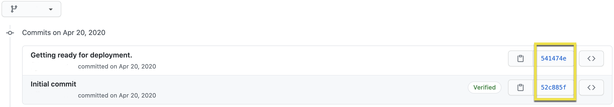
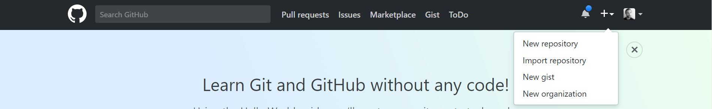
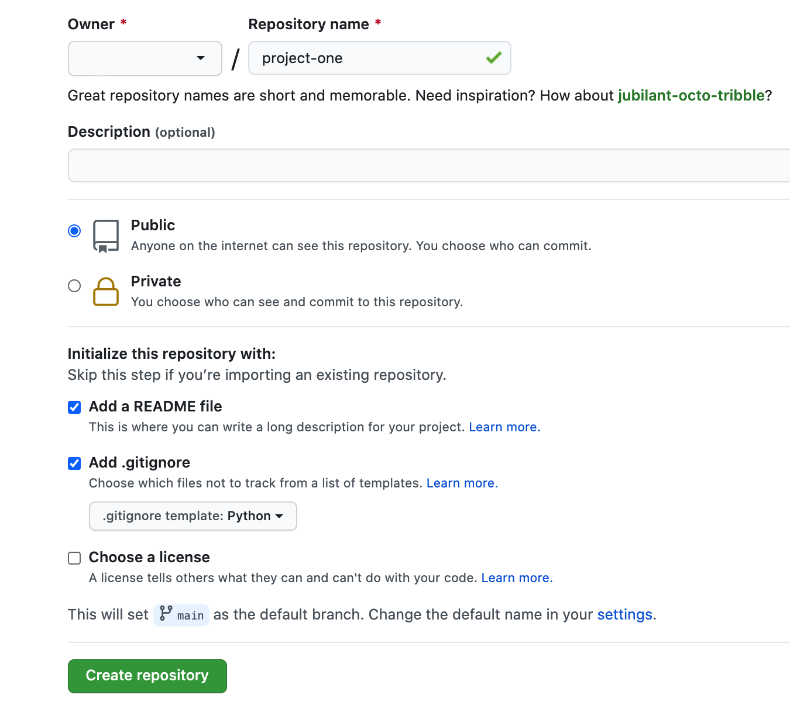
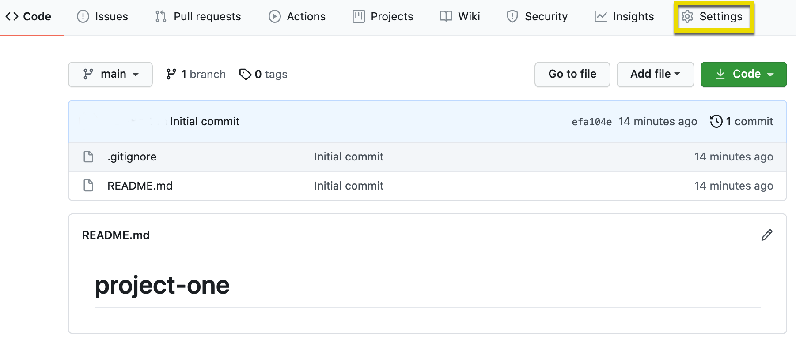
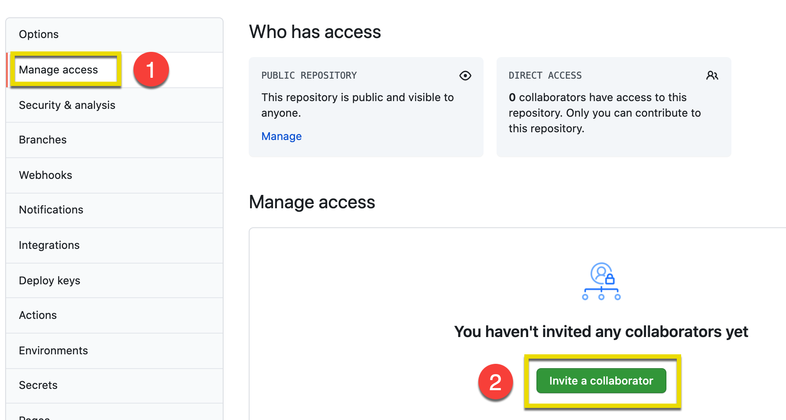
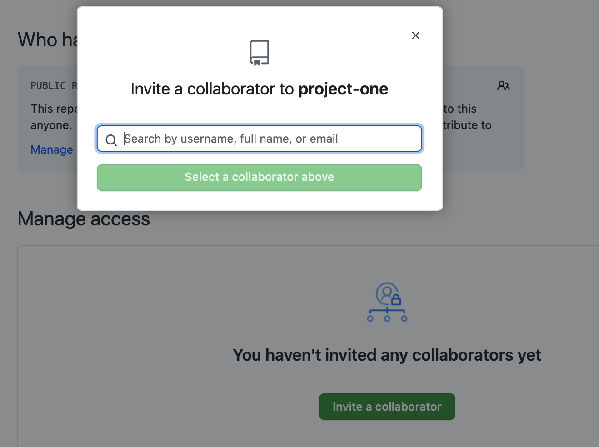
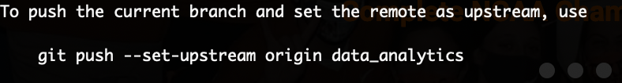
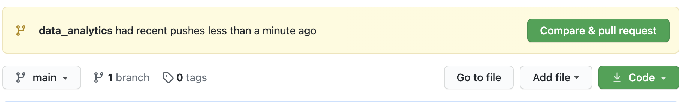
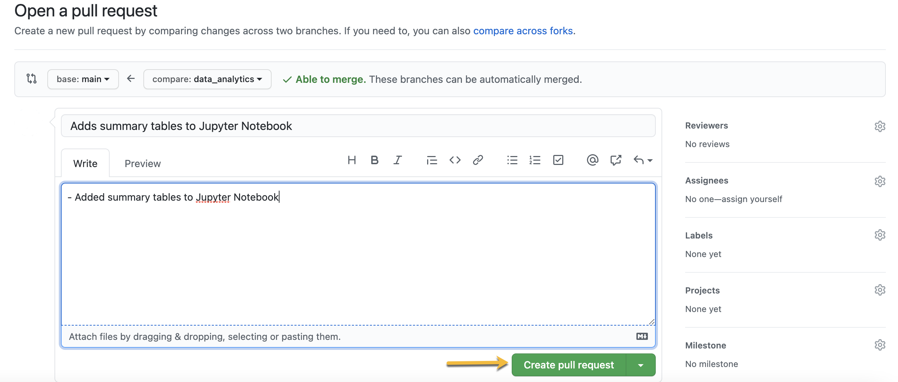
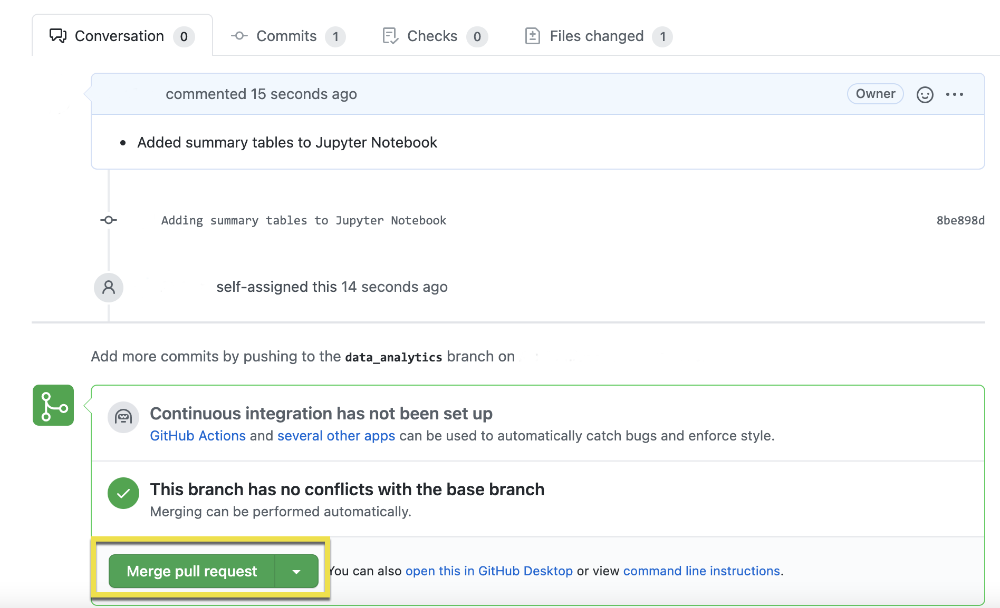

# Module 20-1 Class 1: GitHub for Teams and Project Collaboration

## Overview

This week, we will be introducing best practices for working on tech teams, including how to work in groups and how to use GitHub as a collaboration tool.  

In today's class, students will spend time working in groups to create a GitHub repository for the project and then clone the repository. Each team member will create a branch for a feature where they will store their code for the project. 

Please be sure to provide guidance to students on how to use GitHub if needed.

## Learning Objectives:

By the end of this lesson, students should be able to:

* Create a GitHub repository for the project if one has been created.
* Add a README.md file to the repository describing the project.
* Clone the project repository onto their computer.
* Create a feature branch that each team member will use for their code.
* Apply best practices for working in groups.

- - -

## Instructor Notes

* If you have issues with any of today's activities, you may report it [here](http://tiny.cc/BootCampFeedback).
* Teams should have been created already.
* Team members should have picked their roles on the team.

  * **Square:** The team member in the square role will be responsible for the repository.
  * **Triangle:** The member in the triangle role will create a mockup of a machine learning model. This can even be a diagram that explains how it will work concurrently with the rest of the project steps. Or, address how the data will be processed by using the [Machine Learning Flow Chart](https://github.com/coding-boot-camp/DataViz-Online/blob/master/04-Instructor-Resources/resources/machine_learning_flow_chart_tool.md) to guide them.
  * **Circle:** The member in the circle role will create a mockup of a database with a set of sample data, or even fabricated data. This member will ensure that the database works seamlessly with the rest of the project.
  * **X:** The member in the X role will decide which technologies to use for each step of the project. Teams with only 3 members will need to decide as a group which technologies will be used for each step of the project.

1. **Set expectations for the session** by telling students that they will be learning best practices for working on teams as well as how to create a GitHub repository for the project. 
2. **Review the provided GitHub documentation.** Encourage students to use the provided GitHub documentation for assistance as they create a repository, clone it, and create branches.
3. **Go over the best practices for working in teams.** Encourage students to follow the best practices for working in teams as covered in the provided links.
4. **Open the floor for questions.** Encourage students to talk about team-member roles, sharing the workload, and any GitHub issues. When students share their screen, encourage them to mute their notifications and use an incognito window to avoid sharing any personal information.

- - -

## Slides

[Project Week 1 Day 1](https://docs.google.com/presentation/d/13pyGVXsg6orDTnAEy6o2CQq4apmSF-YIZsVJPaOBJOs/edit?usp=sharing)

## Student Resources

There are no student resources for this session.

- - - 

## Before Class

### 0. Office Hours

| Activity Time: 0:30       |  Elapsed Time:     -0:30  |
|---------------------------|---------------------------|

<details>
  <summary><strong> 📣 0.1 Instructor Do: Office Hours</strong></summary>

* Before you begin class, hold office hours. Office hours should be driven by students. Encourage students to take full advantage of office hours by reminding them that this is their time to ask questions and get assistance from instructional staff on getting started with their final project.

* Expect that students may ask for assistance with the following: 

  * Deciding on a topic for their project
  * Searching for a dataset or complementary datasets
  * Getting started with exploratory data analysis
  * Creating a mockup or fabricated database
  * Deciding on a machine learning model 

</details>


- - -

## During Class 

### 1. Getting Started

| Activity Time:       0:10 |  Elapsed Time:      0:10  |
|---------------------------|---------------------------|

<details>
  <summary><strong>📣 1.1 Instructor Do: Foundation Setting (0:05)</strong></summary>

* Welcome students to class.

* Direct students to post individual questions in the Zoom chat to be addressed by you or your TAs at the end of class.

* Open the slideshow and use slides 1 - 9 to walk through the foundation setting with your class. 

* **Program Pointers:** Talk through some of the key logistical things that will help students stay on track for the final project. This is an opportunity to speak to what students may need when they're at this particular point of the program. 

* **This Week - Final Project:** Talk through the key skills students will be learning this week. The primary focus of the Day 1 activities is to review and reinforce the basics of GitHub. On Day 2, the activities will be used to check in with each team and make sure they are on track according to the rubric. 

* **Career Connection:** Explore the [Career Engagement Network](https://careernetwork.2u.com/?utm_medium=Academics&utm_source=boot_camp) for more services and resources you’ll benefit from throughout your boot camp journey. 

* **How to Succeed This Week:** Remind your students that they may have moments of frustration this week as they start to work in teams, decide on a project topic, search for a dataset or complementary dataset(s), perform exploratory data analysis (EDA) on their datasets, pick a machine learning model, and create a mockup or fabricated database. Consider sharing something about your personal learning journey. It helps students to recognize that everyone starts somewhere and that they are not alone.

* **Today's Objectives:** Now, outline the concepts that will be covered in today's lesson. Remind students that they can find the relevant activity files in the “Getting Ready for Class” page in their course content.  

</details>

<details>
  <summary><strong>🎉  1.2 Everyone Do: Project Check-In (0:05)</strong></summary>

* Ask the class the following questions and call on students for answers:

    * **Q:** How are you feeling about your progress on the final project so far?

    * **A:** Point out to the students that they’ll be collaborating and combining resources to build an awesome project. Everyone will be using the skills that they’ve learned over the past 20 weeks, and they may even learn some new skills from their teammates. Tell them it’s okay to feel overwhelmed as long as they don’t give up.

    * **Q:** Are you having any issues getting started?

    * **A:** Let's do "fist to five" together. If you are not feeling confident, hold up a fist (0). If you feel very confident, hold up an open hand (5). Let them know that there will be time to go over problems or issues related to the project later in the class. 

</details>


- - -

### 2. Intro & GitHub Practice

| Activity Time:       0:15 |  Elapsed Time:      0:25  |
|---------------------------|---------------------------|

<details>
  <summary><strong> 📣 2.1  Instructor Do: Intro to Group Projects (0:05)</strong></summary>

* Greet the class, and explain that today is the beginning of group project weeks.

* **NOTE:** If students have not yet been assigned to groups, please assign groups  before you start: [3. Group GitHub Activities](#3-group-github-activities).

* Explain that over the next four weeks, students will work in groups to find and analyze a dataset of their choosing.

* Be sure to mention that this provides students with an opportunity to practice their data analysis and collaborative workflow skills.

* Let the students know that the first half of today's class will focus on using Git for collaboration, performing exploratory data analysis (EDA) on their dataset, and working in teams; let them know that they will have the second half of class to focus on their projects.

* Answer any questions the students may have before moving on to the next activity. 

</details>

<details>
  <summary><strong> 📣 2.2 Instructor Do: GitHub Practice (0:10)</strong></summary>

* You can use slides 10 - 12 to assist you for this Q and A. 

* Begin the demonstration by asking the students the following question: 

  * **Q:** Ask the students to explain Git.

  * **A1:** Git is a tool for saving our work as we develop a project.

  * **A2:** Git keeps track of our work over time.

#### Git Commits

* You can use slides 13 - 15 to assist you with this section.  

* Emphasize that whenever we work on a part of a project, it is best practice to save the changes with Git.

  *  "Saving" your changes with Git is called a **commit**, and it represents a "checkpoint" for our project.

    

* Point out that if we make a change that breaks something else in the project during the development phase, Git allows us to restore the working code from a previous commit. 

  * Everytime you save using Git, Git remembers these “checkpoints” as a "commit hash", which is a unique identifier. 

    

* If we made a commit that "broke" something in another part of the code, then we can use this unique identifier to revert the code to a previous commit.

* Let the students know that there are different options for reverting a commit; however, one of the easiest methods is described below:

  * The following Git command reverts the repository to the initial commit shown in the image above.

    ```bash
      git reset 52c885f
    ```

#### Git Branching

* You can use slides 16 - 22 to assist you with this section.  

* Next, present the following scenario to introduce branching: 

* You are working on a project where you need to update the main code in order to analyze demographic data for Uber riders. The code you work on will be added in a branch called "demographic_analysis".  

* Walk through the steps to create the branch, then add the code to the branch. 

  ``` bash
    # Make sure you are in the main branch. 
    git status # If you are in the main branch this command will return, "On branch main".

    # Pull the latest changes from main.
    git pull

    # Clean up the main branch on your computer 
    git clean -xdf

    # Create a new branch "demographic_analysis"
    git checkout -b demographic_analysis  
  ```

* Next, you add the updated file from your computer to the repository and execute the following commands:

  ``` bash
    git status # This will tell what has been added, deleted or modified. 

    # If you are satisfied with the status of the commit, type.
    git add . # To add all the content of your commit. 

    # Not necessary but a good practice is to check the status again.
    git status

    # Write a required commit message 
    git commit -m "adding demographic analysis"

    # Push the changes to the branch.
    git push --set-upstream origin <branch-name>
  ```

* Let the students know that it is a good practice to navigate back to the `main` branch and perform a cleanup of the repository.

  ```python
  # Switch back to the main branch
    git checkout main

    # Clean up the the repository 
    git clean -xdf
  ```

  * Point out that the command `xdf` does the following:
    * The `x` removes files that are ignored by Git.
    * The `d` removes untracked files. 
    * And the `f` forces the cleanup in the event that the Git configuration variable `clean.requireForce` is not set to false.

* Emphasize that the code we added to this code makes it _different_ from the code we started with, and that it lives separately from it.

* In this scenario, we have a version of the code called `main`, which is the "main" version of our code, and a version called `demographic_analysis`, which contains updates.

  * Mention that the `demographic_analysis` branch is based on the `main` branch. That is, it adds to or modifies code currently in the main branch.

* Explain that as other team members make a change to the `main` code, their versions live on different **branches**.

  * A **branch** is essentially a history of updates or changes.

  * In this case, the `demographic_analysis` branch **diverged** from the `main` branch.

* Take a moment to discuss the benefits of having a separate branch for analyzing Uber rider data.

  * It gives our collaborators a chance to review the branch for errors and offer suggestions.

  * After the proposed change has been reviewed, we can update the `main` branch to include the changes in the `demographic_analysis` branch by initiating a **merge**.

#### Git Merging

* You can use slides 23 and 24 to assist you with this section. 

* Explain that **merging** two branches adds the content of the branch that has the changes into the branch it is based on.

  * This is how we can work on new features or bug fixes without affecting the main code.

  * When the code in the new branch (`demographic_analysis`) is merged, it becomes part of the main code (`main`).

  * Collaborators can also avoid stepping on one another’s toes by working on different branches.

* Finally, take a moment to review Git's "Snapshot model":

 > "...Git thinks of its data more like a set of snapshots of a miniature filesystem. Every time you commit, or save the state of your project in Git, it basically takes a picture of what all your files look like at that moment and stores a reference to that snapshot. To be efficient, if files have not changed, Git doesn’t store the file again, just a link to the previous identical file it has already stored. Git thinks about its data more like a stream of snapshots."

  

* Answer any questions the students may have before moving on to the next activity. 

</details>


- - -

### 3. Group GitHub Activities

| Activity Time:       0:40 |  Elapsed Time:      1:05  |
|---------------------------|---------------------------|

<details>
  <summary><strong> 🎉 3.1 Everyone Do: Create a Project Repository (0:10)</strong></summary>

* You can use slides 25 - 32 to assist you with this activity. 

* For this activity, students will create a GitHub repository for their projects.

* The team member assigned the **Square** role as the owner of the repository should follow along with you. They will share the repository throughout the project.

* Go to [GitHub](https://github.com/), then click the `+` in the top-right corner to create a new repository.

  

  * Fill out the fields on the new repository page.

  * Students _should_ initialize with a `.gitignore`.

  * Students should choose `Python` in the .gitignore dropdown.

    

  * This is sufficient to create a repository that everyone can share.

* This is a good time to review the purpose `.gitignore`. You can ask a student to explain what `.gitignore` does, or they can provide an example of its use.

* Next, instruct the owner of the repository to send out the `HTTPS` URL for the repository to their teammates.

  * Team members will `git clone` this link.

* Explain that, by default, only the creator of the repository can push changes.

* Show how to "open up" the repository by adding **collaborators**.

  * Click on the "Settings" tab on the top right of the main page of the repository. 

    

  * On the "Settings" page, click "Manage access" on the left, enter your GitHub password when prompted, then click "Invite a collaborator."

    
  
  * A popup window will appear for the owner of the repository to search for their teammates by GitHub username.

    

  * After teammates have been added to the repository, they will be able to make changes to the shared repository.

* Remind students again that _everyone in the group must clone the new repository_.

  * Make sure that everyone has done this before moving on to the next activity.

* Answer any questions the students may have.

</details>

<details>
  <summary><strong> 🎉 3.2 Everyone Do: Creating Branches (0:10)</strong></summary>

* You can use slides 33 - 38 to assist you with this activity. 

* Make sure you have created a new repository for this activity.

* In the examples below, we use `git status` before every `git commit`. This is a best practice that helps ensure a deliberate commit history. For brevity's sake, this line will be omitted in future files, **but assume we've always run `git status` before any `git commit`**.

#### 1. Clone from GitHub

* If someone has already shared a repository on GitHub, you can **clone** it to your local machine with `git`.

  ```bash
  # Clone an existing repository.
  git clone <repo_url>
  # Navigate into newly created repository directory
  cd <repo_name>
  ```

#### 2. Add Files

* Next, we simply develop as normal and `commit` our changes whenever we make significant progress.

* In general, it's best to **commit early** and **commit often**. Frequent snapshots ensure you'll never be too far from a "last working version."

  ```bash
  # Create a file, called clean_data.py
  touch clean_data.py

  # Add and commit clean_data.py...
  git add clean_data.py
  git status
  git commit -m "First commit."

  # Add cleanup code to clean_data.py...
  git add clean_data.py
  git status
  git commit -m "Clean up provided data."

  # Add code to export clean data...Note that `add .` adds
  # everything in the current folder
  git add .
  git status
  git commit -m "Export clean data as CSV."
  ```

#### 3. Create Branches

* To create a new, isolated development history, we must create **branches**.

  ```bash
  # Create new branch and switch to it
  # Long form: `git checkout --branch data_analytics`
  git checkout -b data_analytics
  ```

* Alternatively, we can create a branch and then switch to it in two separate steps, but that approach is uncommon.

  ```bash
  git branch new_branch_name
  git checkout new_branch_name
  ```

* Once we've created a new branch, we can develop as normal and then add those changes to the branch.

  ```bash
  # Create file to contain data analysis
  git add analysis.ipynb
  git status
  git commit -m "Add Jupyter Notebook for data analysis."

  # Add notebook cells summarizing data
  git add analysis.ipynb
  git status
  git commit -m "Adding summary tables to Jupyter Notebook."

  # Export analyzed data and/or plots
  git add .
  git commit -m "Exporting analysis results and save plots as PNG files."

  # Push the changes to GitHub so others can access your work
  git push --set-upstream origin data_analytics 
  ```

  

* Let the students know that using `git push --set-upstream origin data_analytics` will **push** the code from our computers to GitHub, which makes it easier for your collaborators/teammates to see the work you have done. 

* Answer any questions the students may have before moving on to the next activity. 

</details>

<details>
  <summary><strong> 🎉 3.3 Everyone Do: Creating a Pull Request, Reviewing Code, and Merging (0:10)</strong></summary>

* You can use slides 39 - 48 to assist you with this activity. 

* Point out that after you have pushed the changes to your branch, GitHub will create a message for you to compare the changes you made against the `main` branch. 

  

* After you click "Compare & pull request," GitHub will create a "pull request," or a PR, where you can add a description of the changes you made to the "main" code.

  

* After you enter a title and comments to the pull request, click "Create pull request.” 

* Point out that once a pull request is made, teammates can **pull** the latest changes from GitHub to their computers. 

* Emphasize that pulling the latest changes allows them to access and review the code in the branch.

* After everyone has pushed to GitHub, instruct the class to use the `checkout` command on the `main` branch, and then have everyone navigate to the repository on their computer.

  ```bash
  # Move back to main
  git checkout main
  ```

  * Next, have everyone type and run `git pull`. This will bring the changes into the `main` branch. 

    ```bash
    # Bring in the latest changes.
    git pull
    ```

  * Then, run `git checkout <branch_name>`, where `<branch_name>` is the name of one of their teammates' branches.

    ```bash
    # Checkout the branch.
    git checkout data_analytics
    ```

  * Give students a minute or two to verify that the code they checked out does indeed come from their teammate's branch.

* At this point, your teammates can review and test the code. After testing the code, a teammate can approve the changes or request that changes be made.

* Mention that the review process can be an iterative process of code review/testing, requesting changes, and making updates to the code, etc. 

* Once the code has been approved, the `data_analytics` branch can be **merged** into the `main` branch. 

  ```bash
  # Move back to main
  git checkout main

  # Merge changes on data_analysis with code on main
  git merge data_analytics

  # Delete the data_analysis branch
  git branch -d data_analytics
  ```

* Alternatively, you can merge the branch on GitHub.

  
  
* **Note:** Deleting the `data_analytics` branch isn't necessary, but it's best practice to prune unneeded branches.

* Point out that this process allows us to easily share and test different versions of our code across workstations.

* Answer any questions the students may have before moving on to the next activity. 

</details>

<details>
  <summary><strong> 📣 3.4 Instructor Do: Working in Teams (0:10)</strong></summary>

* You can use slides 49 and 50 to assist you with this activity. 

* As the students begin to work in teams, keep in mind that these teams are not like those formed in the classroom. It is imperative that the team members work together well enough to complete the project.

* Remind the teams that each member should have one of the following roles:

  * **Square:** The team member in the square role will be responsible for the repository.

  * **Triangle:** The member in the triangle role will create a mockup of a machine learning model. This can even be a diagram that explains how it will work concurrently with the rest of the project steps.

  * **Circle:** The member in the circle role will create a mockup of a database with a set of sample data, or even fabricated data. This will ensure that the database works seamlessly with the rest of the project.

  * **X:** The member in the X role will decide which technologies to use for each step of the project. If the team has only three members, then all three members should be contributing to these decisions.

* Assist any teams who have members without assigned roles.

* Remind the students that communicating often and early is important for all team members, and especially for remote workers. Some members may have to meet more frequently over Slack and Zoom.

* Send out the following links on working in teams and effective collaboration. Feel free to provide your own materials as well.

  * [Being an effective team player](https://www.dummies.com/business/human-resources/employee-engagement/ten-qualities-of-an-effective-team-player/)
  * [Agile best practices for more effective teams](https://www.planview.com/resources/guide/agile-methodologies-a-beginners-guide/agile-best-practices-effective-teams/)
  * [Agile practices of effective tech leads](https://medium.com/the-andela-way/agile-practices-of-effective-tech-leads-888c46eb1710)
  * [Conflict resolution on agile teams](https://adtmag.com/articles/2014/12/17/agile-conflict-resolution.aspx)
  * [Using a Trello board](https://trello.com/en-US)
  * [Using a LucidChart](https://www.lucidchart.com/blog/virtual-remote-building-games)
  * [Scrums for agile workflow](https://www.altexsoft.com/blog/business/25-scrum-process-best-practices-that-set-your-agile-workflow-for-efficiency/)
  * [Using VS Code for pair programming](https://medium.com/@ibrahimbutt/how-to-set-up-vscode-for-remote-pair-programming-e5f5c30a48e2)
  * [VS Code Live Share](https://code.visualstudio.com/blogs/2017/11/15/live-share)
  * [Working on Zoom as a team](https://zoom.us/feature/messaging)

* Answer any questions the students may have before moving on to project development time. 

</details>


- - -

### 4. Final Project Development

| Activity Time:       0:50 |  Elapsed Time:      1:55  |
|---------------------------|---------------------------|

<details>
  <summary><strong>📣  4.1 Instructor Do: Project Development Consultation (0:50) </strong></summary>

* Have the students work on their final project. Let them know that you'll be checking in on the progress each team has made. 

* This is the first time during this cohort that learners will be working in groups, so be prepared for various challenges, such as difficulty with the following:

#### GitHub cloning, branching, and merging

* Review the [3. Group GitHub Activities](#3-group-github-activities) if necessary. 

* Provide the following link to [Git Basics – Branching, Merging and pushing code to Github](https://webtuu.com/blog/04/git-basics-branching-merging-push-to-github)

#### Deciding on a project topic

* Provide the following tips to the teams that may be undecided on a topic. 
* What motivates the teammates? 
* Is there a question or problem that you want to answer, and, if so, why? 
* Find a common ground and be reasonable.

#### Picking a dataset

* Remind the students to make sure they pick current data. If teams haven't found a dataset, they are free to use data from any source, but we recommend the following curated sources of high-quality data:
  * [data.world](https://data.world/)
  * [Kaggle](https://www.kaggle.com/)
  * [Data.gov](https://www.data.gov)
  * [Public APIs](https://github.com/abhishekbanthia/Public-APIs)
  * [Awesome-APIs List](https://github.com/Kikobeats/awesome-api)
  * [Medium APIs List](https://medium.com/@benjamin_libor/a-curated-collection-of-over-150-apis-to-build-great-products-fdcfa0f361bc)
  * [UCI ML Repository](https://archive.ics.uci.edu/ml/index.php)
  * [Google's Database search engine](https://datasetsearch.research.google.com/)
 
#### Cleaning, organizing, and performing exploratory data analysis (EDA)

* Provide the following link to [EDA in Python](https://medium.com/@atanudan/exploratory-data-analysis-eda-in-python-893f963cc0c0) to help students get started. 

* Remind them that many of the methods and functions they have used with Python and Pandas are part of the EDA process.

#### Setting up a database

* Let the teams know that a mockup of a model is good enough for this segment, but adding an entity relationship diagram (ERD) will go a long way for the development of the database.

#### Selecting a machine learning model

* Let the teams know that a mockup of a model showing a flow chart is good enough for this segment, but by next week the machine learning model should be in the functioning stage. 

#### Resolving team conflicts. 

* Send out the links in section [3.4 Instructor Do: Working in Teams](#3-group-github-activities) to help them resolve team conflicts. 

* Create breakout rooms for each team, and have them begin working on their project. If a team is not currently checking in with you, they should be focusing on their project goals for this segment.

* **Note:** Depending on the number of teams in your cohort, break up the time allotment to spend an equal amount of time with each team.

* Answer any questions before ending class. 

</details>


- - - 

### 5. Ending Class

| Activity Time:       0:05 |  Elapsed Time:      2:00  |
|---------------------------|---------------------------|

<details>
  <summary><strong>📣  5.1 Instructor Do: Project Progression&mdash;Next Steps (0:05) </strong></summary>

* You can use slides 52 and 53 to assist you with this activity. 

* Before ending class, let the teams know where they should be on their project timeline for next class. 

* For the next class, the students should be working on the following:
  * Creating a mockup of a machine learning model. 
    * They can even have more than one model depending on whether they're making predictions or classifications.  
  * Creating a mockup or fabricated database using an ERD.
  * Creating an outline for the final dashboard. 
  * Creating branches on GitHub with working code for EDA. 

</details>


---

© 2021 Trilogy Education Services, LLC, a 2U, Inc. brand.  Confidential and Proprietary.  All Rights Reserved.
