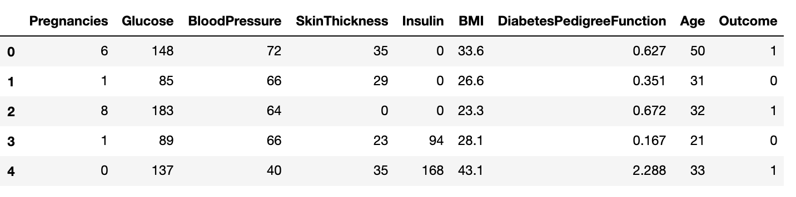
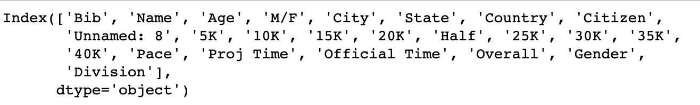
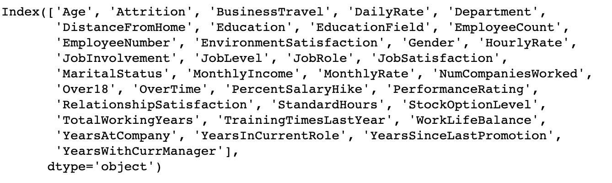

# Module 20-2 Class 2: Choosing a Machine Learning Algorithm and Project Work

## Overview

Today, teams will be reviewing the pros and cons of three different machine learning models for the first half of the class. This will help them to determine which model fits best with their team’s project. Teams should already have a good idea about the type of model they'll be using, and the extra time today should solidify which model they’ll use.  

For the second half of class, the teams will present the progress they've made on their project in a check-in with the instructor. For this week, all teams should have a topic and dataset(s) and should be nearing completion of the EDA. Also, all teams should be making significant progress in the database integration. 

## Learning Objectives

By the end of class, students will be able to:

* Articulate the use cases for each machine learning model
* Decide which machine learning model will fit their project best

- - -

## Instructor Notes

* **Set expectations for the session** by telling students that this session will be used to review three different machine learning models and practice using one of those models on a dataset. 

* **Review the basics of each machine learning model type.** There will be many different types of projects, and some machine learning models will work better than others. Review the current projects and assess whether they're using the correct model for the task.

* **Open the floor for questions.** When you are in [3. Machine Learning Modeling](#3-choose-your-machine-learning-model), engage students in a discussion about the different types of machine learning models available; ask them why they chose their particular model. When students share their screen, encourage them to mute their notifications and use an incognito window to avoid sharing any personal information.

* If you have issues with any of today's activities, you may report it [here](http://tiny.cc/BootCampFeedback).

## Slides

[Project Week 2 Day 2](https://docs.google.com/presentation/d/1i-cqMAjnX-DAEnKRi80ti-0oGhb71MCnaM9peAN-F3o/edit?usp=sharing)

## Student Resources

There are no student resources for this session.

- - - 

## Before Class

### 0. Office Hours

| Activity Time: 0:30       |  Elapsed Time:     -0:30  |
|---------------------------|---------------------------|

  
<strong>📣  Instructor Do: Office Hours</strong>

Encourage students to take full advantage of office hours by reminding them that this is their time to ask questions and get assistance from instructional staff on their final project.

* Expect that students may ask for assistance with the following: 

  * Optimizing the machine learning model
  * Cleaning the data and creating visualizations
  * Transforming or loading data for the database 
  * Integrating the database with the project
  * Working on their dashboard
  * Debugging
  * Issues with merging PRs on GitHub
  * Help with computer issues

- - - 

## During Class

### 1.  Getting Started

| Activity Time:       0:05 |  Elapsed Time:      0:05  |
|---------------------------|---------------------------|

  
<strong>📣 1.1 Instructor Do: Foundation Setting (0:05)</strong>

* Welcome students to class.

* Direct students to post individual questions in the Zoom chat to be addressed by you and your TAs at the end of class.

* Open the slideshow and use slides 1- 7 to walk through the foundation setting with your class.

* **This Week - Final Project:** At the start of today’s class, all teams should have a topic and a dataset or datasets, and they should be completing EDA on the data and making significant progress with integrating their database. By the end of this week, EDA should be complete, the database should be integrated, and the visuals for the data story and a storyboard for the final dashboard should be created. 

* **Today's Objectives:** Now, outline the concepts covered in today's lesson. 

- - - 

### 2. Group Project Check

| Activity Time:       0:10 |  Elapsed Time:      0:15  |
|---------------------------|---------------------------|

  
<strong>🎉  2.1 Everyone Do: Group Check-In (0:05)</strong>

* Open the [Zoom Polling](https://support.zoom.us/hc/en-us/articles/213756303-Polling-for-Meetings) feature or a [Poll Everywhere](Poll Everywhere: Host interactive online meetings), and launch a poll of the class to identify areas that students would like to review from this week's project week.

* **Poll Text:**
How are you feeling about the current state of your project?

  * It's ready for the next stage!
  * I'm a little stressed, but it will be ready for the next stage in time.
  * I'm really worried. Help!
  * I haven't started yet. Help!

* Use the results as a gauge for how the groups are feeling, and keep the results in mind during check-ins.

    
<strong> 📣 2.2 Instructor Do: Slide Show (0:05)</strong>

* You can use slides 8 - 12 to assist you with this activity. 

* Using **slide 9**, emphasize to the students that by this point, they should have the following points completed; if they do not, they should make sure to get to this point as soon as possible or risk following too far behind schedule.

* Using **slide 10**, remind the students that some of them may have to help others to prevent the project falling behind schedule; communication among team members is vital to the completion of the project.

* Using **slide 11**, point out that today is for project work, but it is also a good chance to get assistance if they are having issues. The instructional team will also go around to have the groups show their progress up to this point.

* Using **slide 12**, explain that when a member of the instructional staff approaches the group, they should be ready to discuss or show the progress they have made up to this point. This should be in the form of code&mdash;on GitHub, Google slides, or a storyboard they would show to a shareholder. The groups should be prepared to discuss their machine learning model, their database and its relationships, their dashboard, and where they should be next week.

- - -

### 3. Choose Your Machine Learning Model

| Activity Time:       0:40 |  Elapsed Time:      0:55  |
|---------------------------|---------------------------|

  
<strong> 📣 3.1 Instructor Do: Machine Learning Model Review (0:15)</strong>

* You can use slides 13 - 27 to assist you with this activity. 

* Choosing a machine learning model is an important part of this project; some teams may have a chosen model that isn't working as expected or may not be making accurate predictions.  

* In this demonstration, you will go over the following steps to help teams decide if they need to pick a new model or optimize their model.

* **Step 1: Analyze the input data**

* You can use slides 15 - 17 to assist you with this section. 

  * If the input has data is labeled, choose a supervised learning model.

    * Remind the students that the Pima diabetes dataset had labeled data, so this was a good dataset for supervised learning.

      

  * If the input data is unlabeled, choose the unsupervised learning model.

    * Remind the students that the Boston marathon dataset was a good dataset to classify runners into age groups since there was no "age group" category. 

      

  * If the input data contains a large number of variables or is in a non-tabular format, consider a deep learning model.

    * Remind the students that the IBM dataset we used to predict if an employee was at risk of attrition was a good example of a dataset with a large number of variables&mdash;with 35 columns. 

      

* **Step 2: Analyze the output data**

* You can use slides 18 - 22 to assist you with this section.

  * If the output of the model should predict a value or outcome, choose regression.

    * For the Pima diabetes dataset, we used a regression model to predict outcome. 

  * If the output of the model should be the name of a group or class, choose classification.

    * For the Boston marathon dataset, we used classification to group runners into age groups. 
    * For the IBM dataset, we determined accuracy of the model so we can use it to classify whether an employee is at risk of attrition. 

  * If the output of the model should identify closely related data points, choose clustering.

    * We could also use clustering to classify runners from the Boston marathon dataset into age groups  because the data points are closely related.

* Once you have a firm idea of the data you have and what you hope to get out of it, it's time to look at what algorithm you will run. These are the common algorithms covered in class, but they aren't the only ones.

* **Step 3: Choose your algorithm**

* You can use slides 23 - 26 to assist you with this section.

  * **Linear regression** is used to predict continuous variables. It will take in a set of factors and attempt to learn patterns from them to predict a numerical value. If new data is added, the model will predict the result based on learned patterns&mdash;for example, determining the weight of a person based on caloric intake, height, and activity level.

  * **Logistic regression** is typically used to predict binary outcomes, meaning that there are only two possible outcomes. The model analyzes the available data and, when presented with a new sample, mathematically determines its probability of belonging to a class. If the probability is above a certain cutoff point, the sample is assigned to that class. If the probability is below the cutoff point, the sample is assigned to the other class&mdash; for example, determining if a person will vote "Yes" or "No" on an issue based on things like income, location, and family size.

  * **K-means** is a clustering algorithm used to place data points into groups based on the distance between the points. Points that belong to a cluster are more similar to each other than the points in another cluster&mdash; for example, grouping consumers based on income, time spent in store, amount spent, and age.

  * **Neural networks** are an advanced form of machine learning that can recognize patterns and features in input data and provide a clear quantitative output. They can create a classification algorithm that determines if an input belongs in one category or another. Therefore, neural network models can be an alternative to many of the models we have learned throughout the course, including logistic regression and multiple linear regression.

* **Step 4: Analyze the results and review accuracy**

* You can use slide 27 to assist you with this section.

* Use the following questions to get the teams thinking about the results of their output.  

  * How accurate was your model?

  * Were the results easy to interpret, or are you still not sure what the result is?

  * Did you choose the simplest model to achieve your goals, or did you overcomplicate things with a more advanced model?

  * Will this model reproduce similar results each time it is run, or will the results differ drastically each time?

<strong>✏️ 3.2 Students Do: Choose Your Machine Learning Model (0:25)</strong>

*  In this activity, teams can use supervised, unsupervised, or deep learning on their data to determine if they need to optimize or change their machine learning model for their final project.

* Put teams into breakout rooms, and have them work on their machine learning model. 

* Let the students know that this is their time to refine their model and ask questions. 

* Have the students work on their code for 5-10 minutes, then have them join the breakout room and review the model. 

* If they have already finished testing their model, have them join the breakout room and review their machine learning model.

- - -

### 4. Group Project Check-Ins

| Activity Time:       1:00 |  Elapsed Time:      1:55  |
|---------------------------|---------------------------|

  
<strong> 📣 4.1 Instructor Do: Compare to Rubric (0:05)</strong>

* One way to help teams stay on track is to compare the team's work to the second segment's rubric. Understanding how close they are to each deliverable will tell you a few things:

  * For example, if they aren't meeting any milestones, it could indicate that they're lost or stuck. It could also mean that they aren't very efficient with their time. This is a great opportunity to help realign strategies and goals as needed.

* Click [here](Resources/Segment_2_rubric.pdf) to view the rubric for the first segment.

    
<strong> 📣 4.2 Instructor Do: Conduct Check-Ins (0:55)</strong>

* This week, you will be checking on the progress each team has made on their project. Be prepared for various challenges or roadblocks that each team member may have, such as staying on task, performing EDA, setting up and accessing the database, selecting the right machine learning model, creating a final dashboard, and dealing with team conflicts.

* Create breakout rooms for each team, and have them begin working on their project. When a team is not checking in with you during this time, they should be focusing on their project goals for this segment.

**Note:** Depending on the number of teams in your cohort, break up the time allotment to spend an equal amount of time with each team.

### 5. Ending Class 

| Activity Time:       0:05 |  Elapsed Time:      2:00  |
|---------------------------|---------------------------|

  
<strong>📣  5.1 Instructor Do: Project Progression&mdash;Next Week (0:05) </strong>

* Before ending class, open slides 30 and 31, and let the students know that during our next class, we will be creating and connecting to a PostgreSQL database in RDS on Amazon Web Services. 

  * Send out the following link to [AWS Free Tier](https://aws.amazon.com/free/), and ask students to create a Free Tier account before next class. 

* Next, let the teams know where they should be on their project timeline for next week. 
  
  * Refining their the machine learning model
  * Integrating the database with the project
  * Working on their dashboard
  * Getting all the images you will need for your presentation
  * Adding a project description in the GitHub repository README.md
  * Cleaning up the GitHub repository&mdash;merging branches, removing unneeded files, such as test code, and unused datasets. 
   * Getting ready to add the repository to your portfolio 

- - - 

© 2021 Trilogy Education Services, LLC, a 2U, Inc. brand.  Confidential and Proprietary.  All Rights Reserved.
