# Module 20-2 Class 3: PostgreSQL Database on AWS and Project Work

## Overview

During this week’s session, **Project Week – Build the Pieces**,  students will create an RDS database on AWS, connect the database to PostgreSQL, and work on their project while the instructor checks in on their progress. 

During the first half of today’s class, students will create an RDS database on AWS and connect to it using PostgreSQL; during the second half of class, they’ll spend time working on their group project. 

## Learning Objectives

By the end of class, students will be able to:

* Create a connection to a PostgreSQL RDS database on AWS

- - -

## Instructor Notes

* **Set expectations for the session** by telling students that this session will be used to set up an RDS database in AWS and connect to the database with PostgreSQL. Let them know to attend office hours for help if they have trouble in any phase of the setup and connection. 

* **Review AWS Free Tier service.** Take some time at the beginning of class to explain that we are only using Free Tier services in class. Let the students know they should review the [AWS Free Tier PDF](AWS-Free-Tier.pdf) provided in the student resources link and the [AWS Free Tier](https://aws.amazon.com/free/) link in order to avoid accidentally incurring charges. 

  * **Note**: If the free trial for your personal AWS account has expired, it may be best to create a new account that has access to all Free Tier options.

* **Setting up an AWS Free Tier account.** Make sure the students have created a Free Tier account. If not, send out the following link to [AWS Free Tier](https://aws.amazon.com/free/) and ask students to create one. 

* If you have issues with any of today's activities, you may report it [here](http://tiny.cc/BootCampFeedback).

## Slides

[Project Week 2 Day 3](https://docs.google.com/presentation/d/1kmFi6g90YvtMZuNicb2620eZgGccyHQTTQl3hPu7VVQ/edit?usp=sharing)

## Student Resources

If students were unable to download today's [activity resources](https://2u-data-curriculum-team.s3.amazonaws.com/data-viz-online-lesson-plans/20-Lessons/20-2-3-Student_Resources.zip) from Canvas, please share them with the students.

- - -

### 0. Office Hours

| Activity Time: 0:30       |  Elapsed Time:     -0:30  |
|---------------------------|---------------------------|

  
<strong> 📣 0.1 Instructor Do: Office Hours</strong>

* Before you begin class, hold office hours. Office hours should be driven by students. Encourage students to take full advantage of office hours by reminding them that this is their time to ask questions and get assistance from instructional staff for their final project.

* Expect that students may ask for assistance with the following: 

  * Optimizing their machine learning model
  * Cleaning the data and creating visualizations
  * Transforming or loading data for the database 
  * Integrating the database with the project
  * Setting up a Free Tier account in AWS
  * Debugging
  * Issues with merging PRs on GitHub
  * Help with computer issues

- - -

## During Class 

### 1. Getting Started

| Activity Time:       0:10 |  Elapsed Time:      0:10  |
|---------------------------|---------------------------|

  
<strong>📣 1.1 Instructor Do: Foundation Setting (0:05)</strong>

* Welcome students to class.

* Direct students to post individual questions in the Zoom chat to be addressed by you or your TAs at the end of class.

* Open the slideshow and use slides 1 - 8 to walk through the foundation setting with your class.  Then, you can use slides 9 - 16 as needed for the remainder of the activities. 

* **Program Pointers:** Talk through some of the key logistical things that will help students stay on track for the final project. This is an opportunity to speak to what students may need when they're at this particular point of the program. 

* **This Week - Final Project:** Talk through the key skills students will be learning this week. The activities for Day 1 will focus on creating an RDS database on AWS, connecting to the database using PostgreSQL, and giving students time to work on their final project. On Day 2, the teams will be working on their final project while the instructor checks on their progress to make sure they are on track according to the rubric. 

* **How to Succeed This Week:** Remind your students that they may encounter roadblocks or moments of frustration while setting up and connecting to the RDS database on AWS, optimizing their machine learning model, and applying various coding techniques. Consider sharing something about your personal learning journey. It helps students to recognize that everyone starts somewhere and that they are not alone.

* **Today's Objectives:** Now, outline the concepts that will be covered in today's lesson. Remind students that they can find the relevant activity files in the “Getting Ready for Class” page in their course content.  

  
<strong>🎉  1.2 Everyone Do: Project Check-In (0:05)</strong>

* Ask the class the following questions and call on students for answers:

    * **Q:** How are you feeling about your progress on the final project so far?

    * **A:** Remind students that their project should be at the following steps of their lifecycle: 
      * Their machine learning model should be plugged into their project but may need some optimization.
      * Their database should be plugged into their project but may need some refining.
      * They should have all the images for the final dashboard. 

    * **Q:** Do teams remember how to connect to a database on AWS? 

    * **A:** Let the teams know that you will be covering how to create an RDS database on AWS and connect to the database using PostgreSQL in the first half of today’s session. 

   * **Q:** Are the teams making progress on their machine learning model?

    * **A:** Let the teams know that you will assist them in the project development consultation section in the second half of today’s session. 

- - -

### 2. PostgreSQL Database Creation and Connection on RDS

| Activity Time: 0:30 |  Elapsed Time: 0:40  |
|---------------------------|---------------------------|

  
<strong> 🎉 2.1 Everyone Do: Create a PostgreSQL Database in RDS (0:15)</strong>

* In this group activity, the students will create a PostgreSQL database in RDS on Amazon Web Services. 

* Make sure the students can download and open the [AWS Free Tier](AWS-Free-Tier.pdf) and [AWS_RDS_guide.pdf](AWS_RDS_guide.pdf) files from the AWS link. 

  * **Note:** Let the students know that Amazon often changes the interface on the management console, so the steps provided in these documents may differ slightly from the current settings. 

  * Send out the link to [Creating and connecting to PostgreSQL DB instance](https://docs.aws.amazon.com/AmazonRDS/latest/UserGuide/CHAP_GettingStarted.CreatingConnecting.PostgreSQL.html) for the latest on creating a PostgreSQL database. 

* Explain to students that today's class will utilize Amazon Web Services. Everything used in class will be available under Amazon's Free Tier program, but students should be careful not to choose any options that have associated costs. Students should also delete their RDS databases after class so that no further costs are incurred. We will cover the steps for deleting RDS databases at the end of class.

* Log in to the AWS Management Console and navigate to the **RDS** section under **Database**.

  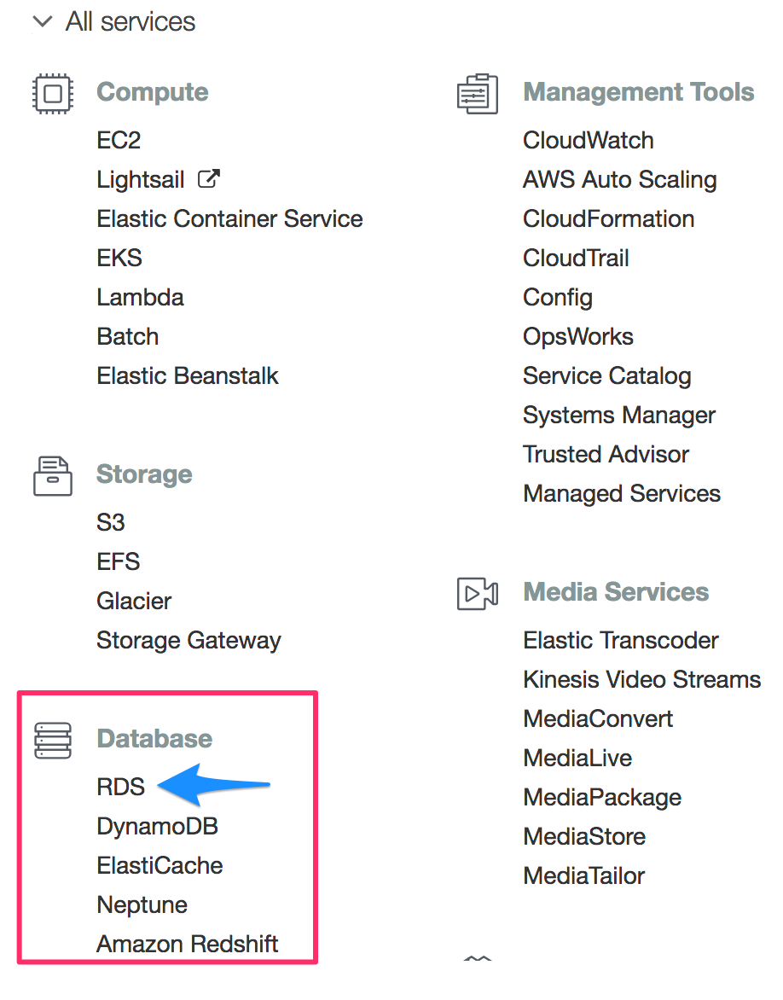

* Scroll down to the "Create database" section and click the **Create database** button. 

* **Note** AWS may have a different screen than the one pictured below. If this is the first time using the service, the orange **Create database** will still be at the bottom.

  * **Important!** Tell the students not to click the **Create database** button at the top under the "Amazon Aurora" section. 

  

* After clicking the **Create database** button, you will be redirected to the "Create database" page to begin the configuration of your database. 

  * **Note:** On the new database creation flow, you will see a "Create database" section with two options. If students see this page, tell them to select the "standard create" option; this is where we'll set all the configuration options. 

    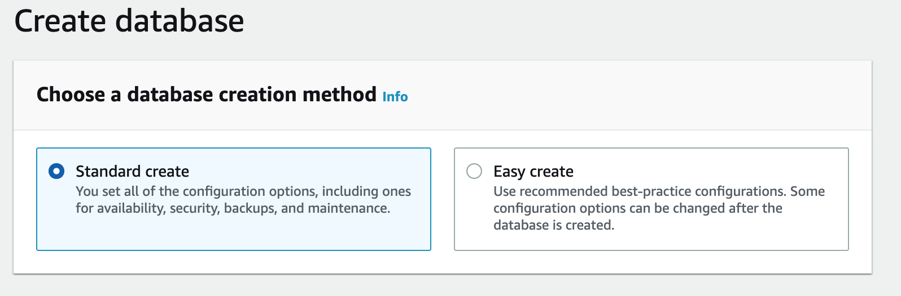

* Next, in the "Engine options" section, select **PostgreSQL** and version `11.11-R1` is sufficient. 

  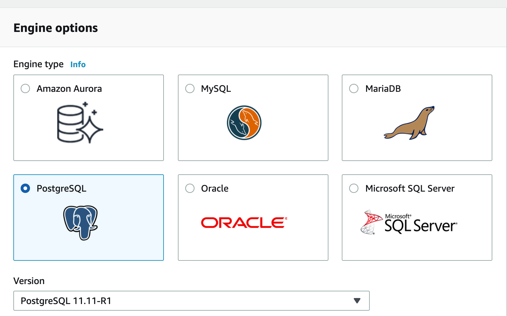

* If available, under **Templates**, select **Free Tier**.

  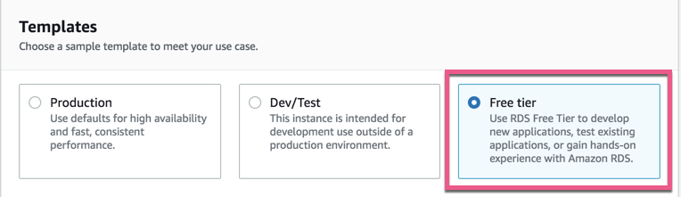

* Fill out the fields under “Settings.” 

  * In **step 1**, give your database instance identifier the name `myPostgresDB`, and in **step 2**, use `root` as the master username.

    * **Note**: Although the database instance identifier and master username can take any name you choose, we recommend sticking to these settings in this case for consistency.

  * In **step 3**, uncheck the "Auto generate password" box.

  * In **step 4**, enter a password and be sure to record it somewhere. The other settings will be accessible in the future, but the password will not.

    

* In the "Additional configuration" section, make sure the port is `5432`, and "Password authentication" is selected in the "Database authentication" section. 

  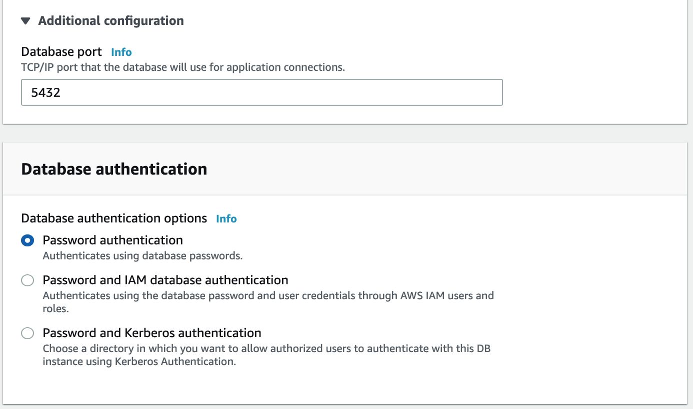

* In the "Connectivity" section, select "Yes" under the "Public accessibility" option. 

  * Explain that this does not mean anyone can access the database, as a password is still required, but it allows connections from outside sources like pgAdmin.

    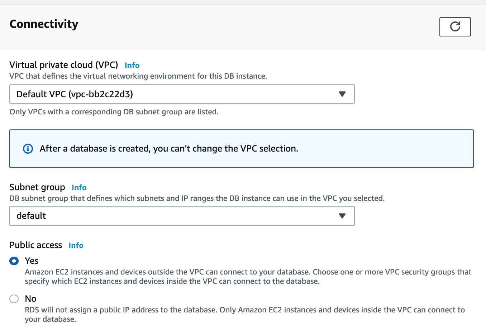

  * Next, in the "Additional configuration" section, click the down arrow to show the "Database options" fields. 

  * Name your database **my_data_class_db** for the sake of consistency. Keep the default settings in the other fields.

  * And, in the "Backup" section, **uncheck** the boxes for "Enable automatic backups" and "Enable Performance Insights."

    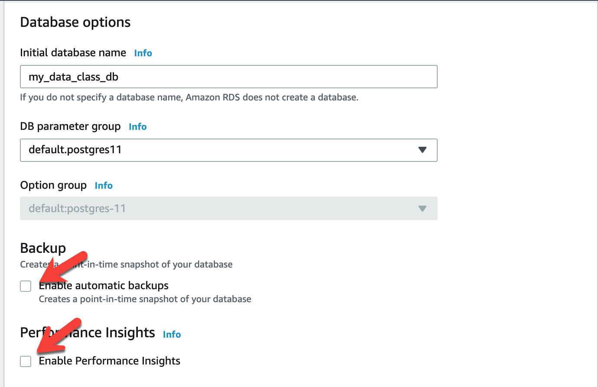

  * And, **uncheck** the boxes for "Enable Enhanced Monitoring" and "Enable auto minor version upgrade."

    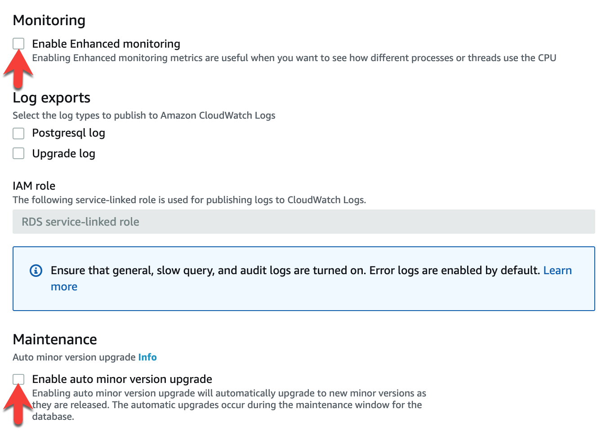

  * Leave everything else as is, and be sure to mention to students the **estimated monthly costs** at the end. 
  
* Now, explain Free Tier: 

  * Free Tier was selected so these costs will not be incurred.

  * We will clean up the database at the end of class to make sure nothing is left running.

* For the last step, click **Create Database** followed by **View DB Instance details** to navigate to the instance console page. 

* **Note:** The database creation on AWS's end will take anywhere from 10 to 15 minutes.

  
<strong> 🎉 2.2 Everyone Do: RDS PostgreSQL and pgAdmin (0:15)</strong>

* First, make sure that the team member assigned the **Triangle** role as the owner of the database follows along with you. If that team member's database is not up and running, then another team member that has their database up and running should follow along. Any team member who wants to follow along is welcome. 

* Explain the following about the new RDS database:

  * RDS stands for Relational Database Service. This is what Amazon uses to host a variety of relational databases in the cloud.

  * These databases can have different dialects, such as MySQL, PostgreSQL, and Amazon's own Aurora database.

  * The database that was created at the beginning of class uses PostgreSQL.

* In the console, navigate to the DB instance created earlier. There will be a lot of information available, but we'll use only a few points of interest. Go over the console page, explaining these key points:

  * The "Summary" section shows the kind of database the instance is and whether it is available.

    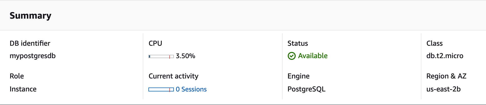

  * The database metrics can largely be ignored for now.

  * The "Connectivity and security" tab lists the endpoint, port, and security groups associated with the instance. The endpoint will be used to connect to the database.

    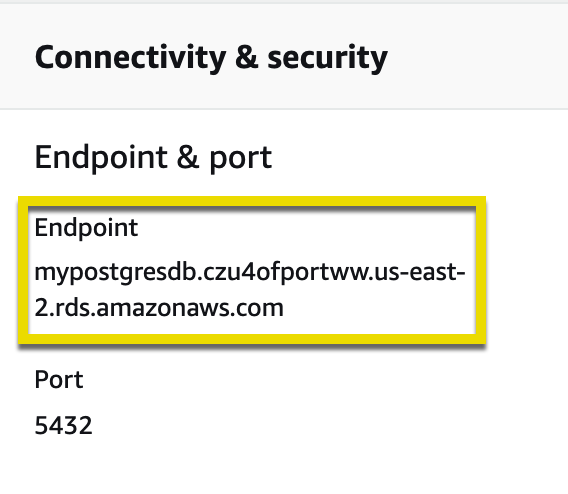

  * The rest of the tabs contain more information about the instance, such as backups and logs, but students will not need to be concerned with these tabs for class.

* Have the students open the [AWS_RDS_guide.pdf](AWS_RDS_guide.pdf) to follow along, especially the team member assigned the **Triangle** role.  

* Make sure everyone has the pgAdmin 4 UI installed. Direct students who do not have it installed to the [pgAdmin download page](https://www.pgadmin.org/download/) to download the appropriate version for their operating system.

* Open up the pgAdmin UI. Explain the following to students:

  * pgAdmin will connect to a cloud-based database, such as AWS, as well as local databases.

  * pgAdmin offers a visual interface for managing data.

* Log in to the AWS console and navigate to "RDS" under "Database."

  

* Click on the "Services" dropdown arrow on the top left, and then select "RDS". In the "Resources" section to the right, select "DB Instances."
 
  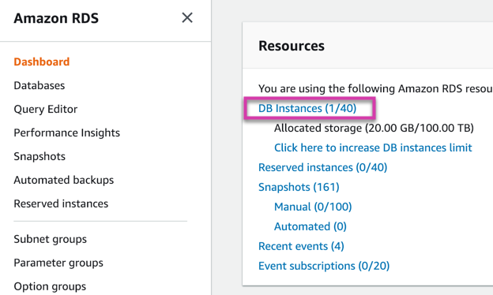

* Go to the database created earlier, `mypostgresdb`.

* Navigate to the "Security Group" rules section on the right, and explain the following:

  * These security groups tell the RDS instance what traffic is allowed in and out of the database.

  * The security settings can range from restrictive, such as a specific URL, to open.

* In this activity, the database will be open to all traffic; however, this is not recommended for production code. 

* Click the security group for type "CIDR/IP - Inbound."

  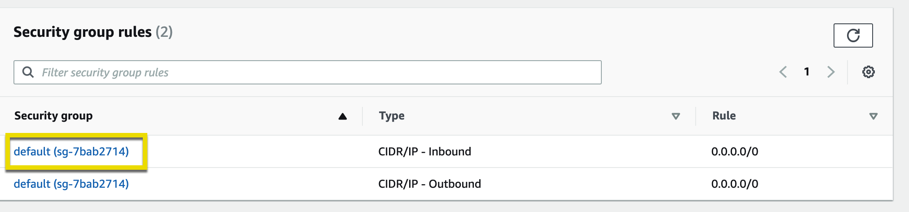

* You will be redirected to a new page. Follow these steps to give the database access to all inbound traffic:

  * Click on the "Inbound rules" tab,then click **Edit Inbound Rules**. This will bring up a menu to set rules for the security group.

    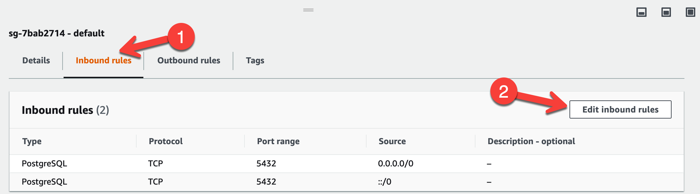

  * Change the “Source” to "Anywhere" and click **Save**. The RDS instance will now accept a connection from anywhere. This isn't completely open to the world because the endpoint, username, and password are still needed to connect.

      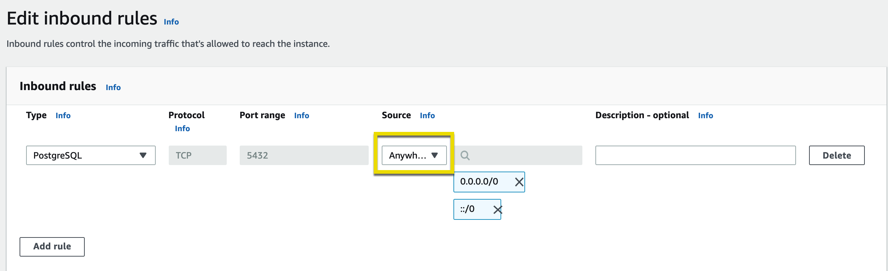

* Navigate back to the instance console, and have the class find the endpoint in the "Connectivity" tab.

  

* Open up pgAdmin, right-click **Servers**, and then go to "Create - Server". Then, walk through the following steps to create a connection to the AWS RDS instance:

  * Under the "General" tab, enter the server name as `my_aws_postgres_rds`.

    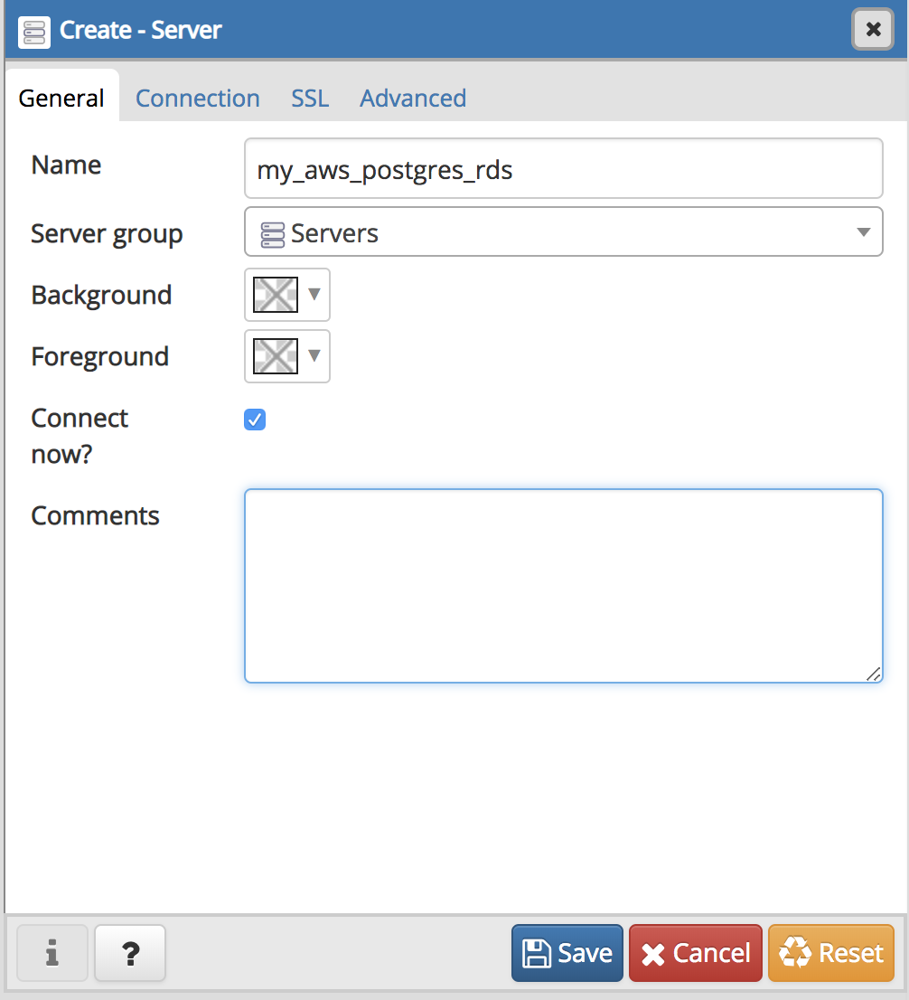

  * Under the "Connection" tab, do the following:

    * Enter the endpoint in the "Hostname/address" field. This is unique to the instance.

    * Enter 'postgres' in the "Maintenance database" field. This is the default for all postgres RDS instances.

    * Enter the username in the "Username" field&mdash;in this case, `root`.

    * Enter the password that was created for your RDS instance.

    * Check the box next to "Save Password."

  * Click **Save**. If all information is entered correctly, this will set up the connection and not return an error.

    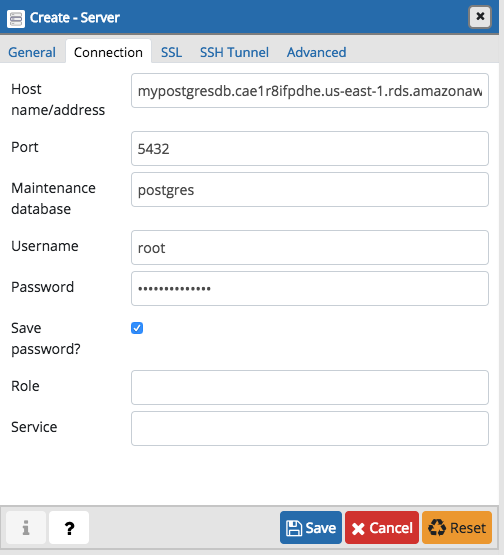

* To delete a database, students can follow this link on [Deleting a DB instance](https://docs.aws.amazon.com/AmazonRDS/latest/UserGuide/CHAP_GettingStarted.CreatingConnecting.PostgreSQL.html#CHAP_GettingStarted.Deleting.PostgreSQL).

  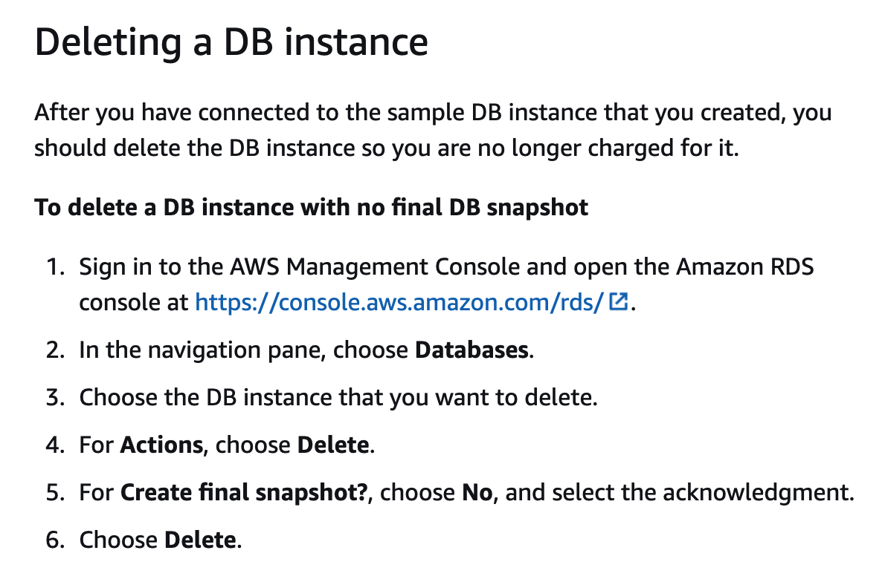

* Have the TAs verify that every student has a working connection in pgAdmin. Since the class should be using the same username and DB name, the biggest issue could be passwords.

- - -

### 3. Final Project Development

| Activity Time:       1:15 |  Elapsed Time:      1:55  |
|---------------------------|---------------------------|

  
<strong>📣  3.1 Instructor Do: Project Development Consultation (1:15) </strong>

* Have the students work on their final project, and let them know that you'll be checking in on the progress each team has made on their project. 

* Create breakout rooms for each team, and have them begin working on their project. If a team is not currently checking in with you, they should be focusing on their project goals for this segment.

* Encourage participation by reminding them that this is their time to ask questions and get assistance from their instructional staff as they’re working on their projects over Zoom with their team members, so they should take full advantage of the time.

* Expect that students may ask for assistance with the following:

  * Cleaning the data and creating visualizations
  * Transforming or loading data for the database 
  * Integrating the database with the project
  * Setting up a Free Tier account in AWS
  * Debugging
  * Issues with merging PRs on GitHub
  * Help with computer issues 

* **Note:** Depending on the number of teams in your cohort, break up the time allotment to spend an equal amount of time with each team.

* Answer any questions before ending class. 

- - - 

### 4. Ending Class

| Activity Time:       0:05 |  Elapsed Time:      2:00  |
|---------------------------|---------------------------|

  
<strong>📣  4.1 Instructor Do: Project Progression&mdash;Next Steps (0:05) </strong>

* Before ending class, let the teams know where they should be on their project timeline for next class. 

* For the next class, the students should be working on the following:
   * Connecting their machine learning model to the project
   * Optimizing the integration of the database into the project 
   * Cleaning up the GitHub repository&mdash;merging branches, removing unneeded files, such as testing code, and unused datasets. 

---

© 2021 Trilogy Education Services, LLC, a 2U, Inc. brand.  Confidential and Proprietary.  All Rights Reserved.
