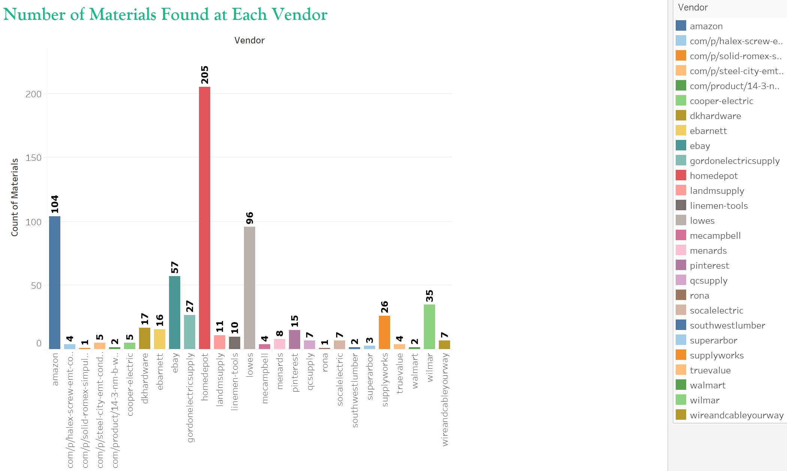
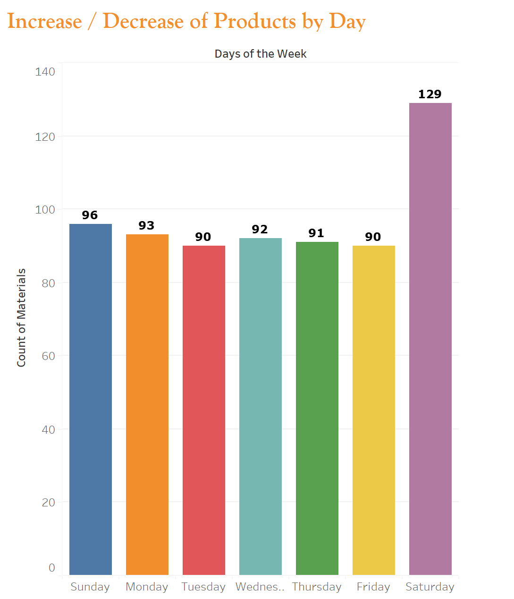
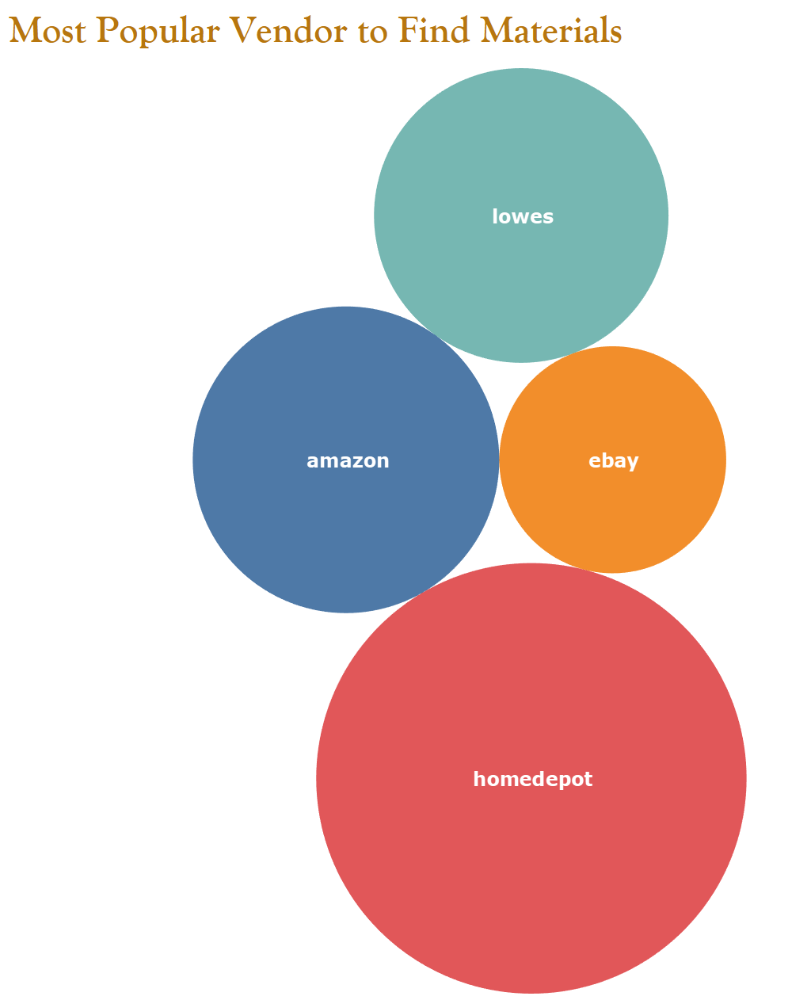
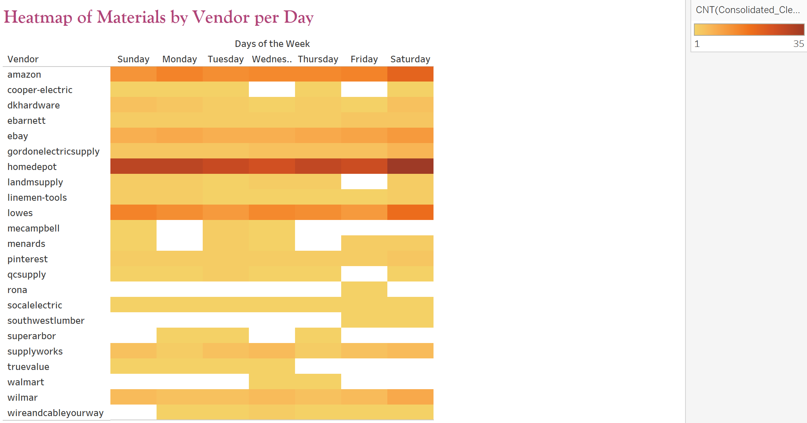

# Estimator_Project
(THIS PROJECT IS CURRENTLY IN PROGRESS)

## Problem Specification #1
I am an estimator. In the old days when we needed to price materials, we would look at a “hot sheet” (a list of materials and their prices generated once a quarter). Now, due to the crazy rise in inflation, material prices must be generated the day the estimate is created. Many hours are lost scouring the net looking for current material prices.

## Problem Specification #2
To save time, estimators do not scour the web to price every small item. For example, when an electrician installs 10 feet of pipe, in addition to the pipe, they will need two connectors, two straps and possibly one coupling. To Account for the costs, estimators will add on a percentage of the bid to cover the small items.

## What we are Doing Here
To save estimators time, We are creating a live HTML/website that uses APIs to search material prices of three electrical materials suppliers. With the data collected, we will produce a table that can be updated daily. This table will list material prices and our algorithm will choose the cheapest priced items of the day to populate our table.

## Tableau Interactive Website

[The Estimator Project](https://public.tableau.com/app/profile/sarah.michelle4772/viz/TheEstimatorProject/Story1?publish=yes)

## Results
At the completion of this project, we hope to:
·       Save time and money for estimators bidding projects by retrieving the lowest prices and the locations of the product.
·       Create an automated table using Python script and APIs.
·       use a multi linear regression model to see if there is a correlation between the increase of large electrical materials and small electrical materials so that we can more accurately estimate for small items.
·       Visualizations that will show prices of materials on different days of the week. For example: If materials are cheaper on Thursday, we could generate savings by only purchasing materials on Thursday.

## Protocols
Members: Kijahre Fikiri, Nancy Fujikado, Sarah-Michelle Sanchez and Alexei Mendoza are the contibutors of this project.

### Description (communication and rules):
1.	The contributors will meet durring normal class time (unless otherwise specified).
2.	The main branch will only be merged with group consensus.
3. 	Feel free to leave notes on the notes board. Please leave name and date along with any comments.

## Weekly Notes Board
In this project, we are tracking prices for (16) items. Originally, we were going to find (3) vendors. I have script that will track the items we are looking for but will require more than (3) vendors to do it because not all vendors list their prices in the search I used (K. Fikiri 10/17/22).

### What the Current script does (see 'Working_Estimator_Script', 'clean_df.csv', 'working_df.csv'):

•	Grabs information (link, title, and price)

•	Creates a ‘Vendor Location’ column (vendor names don’t already exist in the data I grabbed)

•	Cleans raw data:

  	o	Drops na’s

  	o	Drops vendors with scaling issues

•	Returns a csv and excel with:	

	o	Working data set that is cleaned and gives lowest prices

	o	Cleaned data set that gives all prices

### What Currently Needs Work (10/18 to 10/25):

•	Create data base 

•	Create code that automates the search so that our script scrapes the web once a day and sends data to website

•	Polish a deliverable “Segment 1”

## Things to try (I used Python to search using a Home Depot product API and a Google Search API, but...)

•	Does someone want to try searching using JSON instead of Python?

•	Does someone want to try searching using a different type of API?

•	Does someone want to try web Scraping to get the data we need (for a list of the materials we are looking for, see ‘links.py’)

•	Does someone want to try creating an additional column that gives distance of vendor location to a specified zip code?
